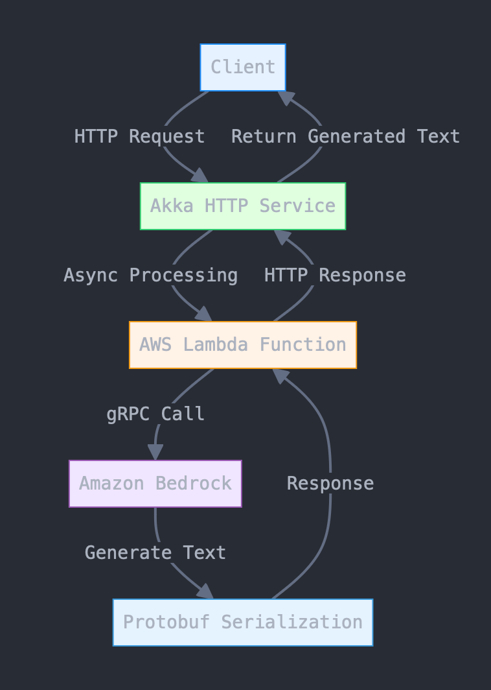
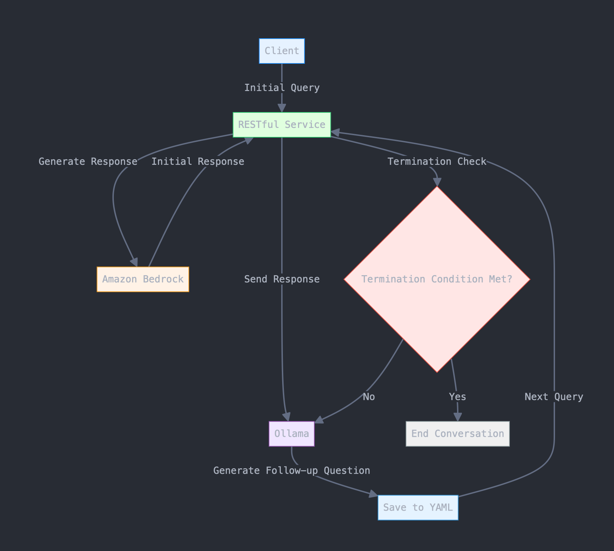

# LLM-Conversational Agent
#### Author: Niharika Belavadi Shekar
#### UIN: 675234184
#### Email: nbela@uic.edu
#### Instructor: Mark Grechanik

## Project Summary
In this project, I have developed a robust conversational agent by integrating **Amazon Bedrock** with **Ollama** through the use of **Akka HTTP** as the chosen framework. I began by setting up two distinct APIs: the first API is responsible for generating output text from Amazon Bedrock based on user input. By leveraging Akka HTTP, I handled incoming HTTP requests, ensuring that each query is processed asynchronously and non-blockingly. To facilitate seamless communication between the service and Amazon Bedrock, To facilitate seamless communication between the service and Amazon Bedrock, I deployed AWS Lambda functions, invoked via **gRPC calls** through **API Gateway**, ensuring high-performance, low-latency interactions. Additionally, I implemented **Protocol Buffers** for efficient serialization, which optimized the data exchange between services. For initial testing, I have utilized **curl** to manually send requests to the APIs, verifying that Amazon Bedrock was generating accurate and timely responses.

The second API I developed conducts an interactive conversation between **Amazon Bedrock** and **Ollama**, creating a dynamic and engaging dialogue system. The client initiates the conversation by sending an initial query to the RESTful service and receiving a generated response from Bedrock. Subsequently, Ollama processes this response to formulate a follow-up question, which is then sent back to the RESTful service, continuing the loop until a predefined termination condition is met. Throughout this interaction, the results are saved using YAML files to capture each pair of queries and responses. By following these structured steps, I successfully created a scalable and efficient conversational system that leverages the strengths of both Amazon Bedrock and Ollama, ensuring meaningful interactions for users.

For a visual overview of the project, please check out the [YouTube Link](https://youtu.be/o4kjQ91r0mM).

## Prerequisites

To successfully run this project, ensure the following prerequisites are met (the operating system used is macOS):

1. **Scala 2.13**: Ensure Scala 2.13 is installed.

2. **sbt (Scala Build Tool)**: Install sbt for building and managing project dependencies.

3. **Java 11 or Later**: Ensure JDK 11 or a newer version is installed. 

4. **IntelliJ IDEA**: Install IntelliJ IDE with the Scala plugin for development and configuration management.

5. **AWS Account and Setup**:
    - **AWS Lambda**: Set up AWS Lambda functions to handle backend processing.
    - **API Gateway**: Configure AWS API Gateway to route HTTP requests to Lambda functions.

6. **Ollama**: Install and configure Ollama for the conversational agent. Ensure the local server is running and properly configured.
7. **curl**: Install `curl` for manual testing of the APIs. It is typically pre-installed on macOS.

Ensure all dependencies and libraries are properly configured in the `build.sbt` file for the project.

## Steps to Execute the Project

1. **Clone the Repository**
   
   ```bash
   git clone git@github.com:NiharikaShekar/LLM_ConversationalAgent.git
   ```

2. **Install Dependencies**

   Navigate to the project directory and install the necessary dependencies:

   ```bash
   sbt clean update
   sbt clean compile
   ```

3. **Run the Application**

   Start the LLM server by running LLMServerMain.scala file.
   
4. **Invoke the First API to Generate Text from Amazon Bedrock**

   Use the following `curl` command to send a request to the first API. This API generates output text from Amazon Bedrock based on the provided input.

   ```bash
   curl -X GET \
     http://localhost:8080/query-llm \
     -H "Content-Type: application/json" \
     -d '{"input": "A penny saved is a penny earned", "maxWords": 100}'
   ```

5. **Invoke the Second API to Start the Conversational Agent**

   Use the following `curl` command to start the conversational agent. This API initiates a conversation between Amazon Bedrock and Ollama based on the input provided.

   ```bash
   curl -X GET \
     http://localhost:8080/start-conversation-agent \
     -H "Content-Type: application/json" \
     -d '{"input": "A penny saved is a penny earned", "maxWords": 100}'
   ```


### The flow of the project is depicted in the below diagrams:
#### 1. Text Generation using Amazon Bedrock:

#### 2. Model Training and Prediction:

## Additional Information
- **Customization**: Users can modify the input text to generate different outputs based on their inputs.


Feel free to reach out via email for questions or collaborations!